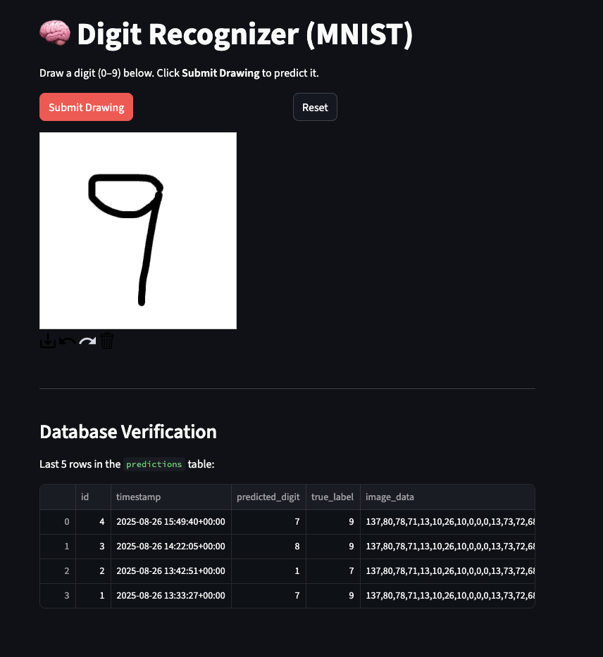

# 🧠 Streamlit Digit Classifier

A simple Streamlit web app that recognizes hand-drawn digits (0–9) using a PyTorch-trained MNIST model.

## ✨ Demo

Draw a digit in the canvas, click **Submit Drawing**, and the model will predict what number you drew — along with its confidence and class probabilities.

 <!-- Optional: add a screenshot of your app UI -->


## 🗂️ Project Structure

streamlit-digit-classifier-app/
│
├── app.py # Streamlit app UI and inference logic
├── model.py # PyTorch DigitClassifier model definition
├── mnist_model.pth # Trained model weights
├── requirements.txt # Python dependencies
└── README.md # Project documentation


## 🛠️ Setup Instructions

### 1. Clone the Repository

```
git clone https://github.com/yourusername/streamlit-digit-classifier-app.git
cd streamlit-digit-classifier-app
```


### 2. Create a Virtual Environment (Recommended)

```
python3 -m venv venv
source venv/bin/activate  # On Windows: venv\Scripts\activate
```

### 3. Install Dependencies

```
pip install -r requirements.txt
```


### 4. Run the App
```
streamlit run app.py
```


The app will open in your browser at http://localhost:8501.


### 🧠 Model Details

Architecture: Simple CNN with ReLU activations and linear layers

Dataset: MNIST handwritten digits

Training: 5 epochs on 60,000 training samples

Model is saved as mnist_model.pth. You can retrain your own model using the same architecture in model.py.

### 🔁 Features

- Interactive drawing canvas
- Dynamic preprocessing pipeline: crop → resize → pad → normalize
- Predictions with confidence and class probabilities
- Feedback form for correcting predictions (for future retraining)
- Reset button to clear canvas

### 🧪 TODO / Improvements
- [ ] Improve prediction accuracy (train longer or augment data)
- [ ] Add data collection from feedback form
- [ ] Deploy to the web (e.g. Streamlit Cloud or Hugging Face Spaces)


### 🙌 Acknowledgements

- [Streamlit](https://streamlit.io/)
- [PyTorch](https://pytorch.org/)
- [streamlit-drawable-canvas](https://github.com/andfanilo/streamlit-drawable-canvas)
- [MNIST Dataset](http://yann.lecun.com/exdb/mnist/)